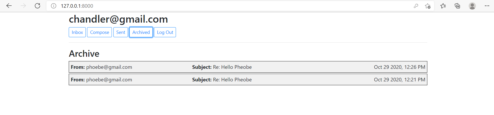

# Mail (Way to communicate through your own mailing system)

### Description
This is a mailing system, back-end in Django and Client-side in Javascript.
It is a single page application from which you can send, recieve, reply, archive the mails.
This was my first Javascript project!!
***
### Video
[Mail](https://www.youtube.com/watch?v=hqaAgx5JTwk)
***
### Features

1. Register:
You will have to make an account on this website so as to use the mailing system.

   
***
2. Login:
Here you will have to login into the account.

   
***
3. Inbox:
Here you will be having your all the mails that are not Archived.

   
***
4. Compose:
Here you will be writing a new mail if desire so, providing the name of the recipients, subject, body of the mail.


***
5. Sent-mailbox:
Here you will be seeing the mails you sent.

   
***
6. Archived:
Here those mails will appear that you have archived.

   
***
7. Reply:
You can reply to the mails that have been recieved by you.

   
***
8. Mail-overview:
You can see the mails just by clicking on them and they will appear like this:

   
***
### Example
Sending mail from user to another:

After sending:


Recieving mail from the above user:
'

Opening the new mail recieved:


Replying the new mail:


After Reply:


How to run this program just write this on terminal:
```Bash
python manage.py runserver
```
